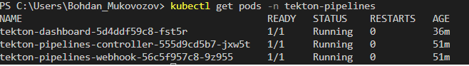
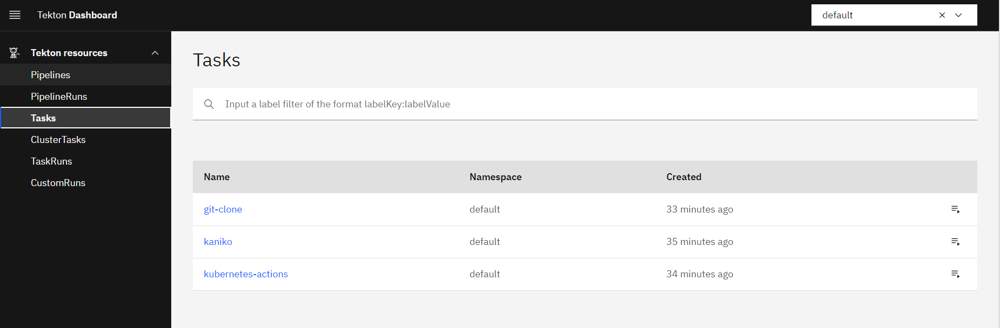
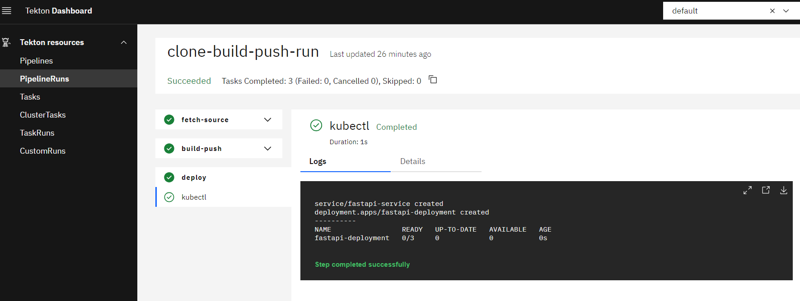
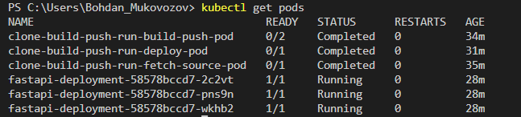
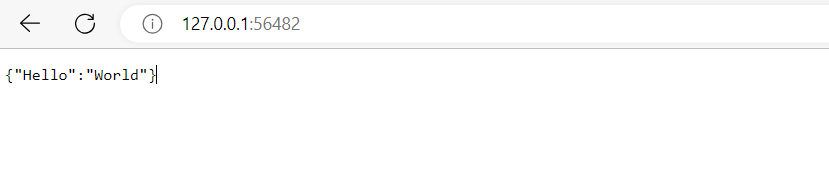

# Tekton Pipeline for Building and Deploying Node.js React Application

This repository contains the necessary resources and instructions to create a Tekton pipeline for building and deploying a FastAPI application in a Kubernetes cluster.

## Pre-requirements
* Minikube 
* Kubectl v.1.25.1 or high
* Go
* Tekton Pipelines

## Installation

To install Tekton in your Kubernetes cluster, follow these steps:

1. Install Tekton Pipelines
```
kubectl apply --filename https://storage.googleapis.com/tekton-releases/pipeline/latest/release.yaml
```
2. Install Tekton Dashboard
```
kubectl apply --filename https://storage.googleapis.com/tekton-releases/dashboard/latest/release.yam
```
After installation dashboard use this command for access to dashboard via URL:
```
kubectl proxy
```
3. Install kubernetes action 
```
kubectl apply -f https://api.hub.tekton.dev/v1/resource/tekton/task/kubernetes-actions/0.2/raw
```
## Creating the Pipeline

To create the pipeline for building and deploying the FastAPI application, use the following steps:

1. Create secret with our Docker credentials:
```
kubectl create secret docker-registry name --docker-server= --docker-username= --docker-password=

NOTE: When you create secret don't use email on username, just only username from your dockerhub
```
2. Create service account for Kubernetes Actions. Manifest located in sa.yaml file
```
kubectl apply -f sa.yaml
```
3. Create a Tekton pipeline with 3 steps:
   ```
   1. Pull code from github
   2. Build image and push to docker hub
   3. Deploy image from previous step.

   kubectl apply -f pipeline.yaml
   ```

5. Install tasks which using in Tekton CLI:
```
tkn hub install task git-clone
tkn hub install task kaniko
```
6. Update kaniko task with manifest named kaniko.yaml
```
kubectl apply -f kaniko.yaml
```
7. Run the pipeline using manifest:
```
kubectl create -f pipelinerun.yml
```
## Results

1. All pods related to tekton working:

2. Verify task and pipeline in dashboard

3. Result of pipeline run

4. Verify your deployments successfully run pods

5. Check in browser our applicaiton
```
NOTE: use that command for allow access if you use minikube 
minikube service fastapi-service --url
```


## Task Performance Estimations

The estimated time required to complete the installation and pipeline creation tasks is as follows:

- Prerequirements: 2 hours
- Pipeline Creation: 6 hours
